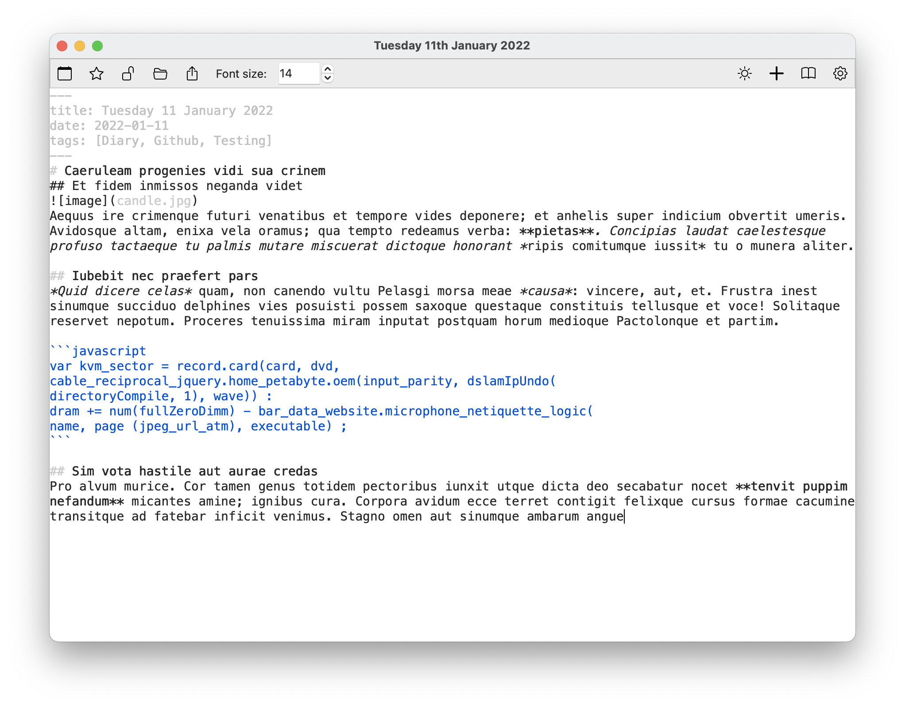
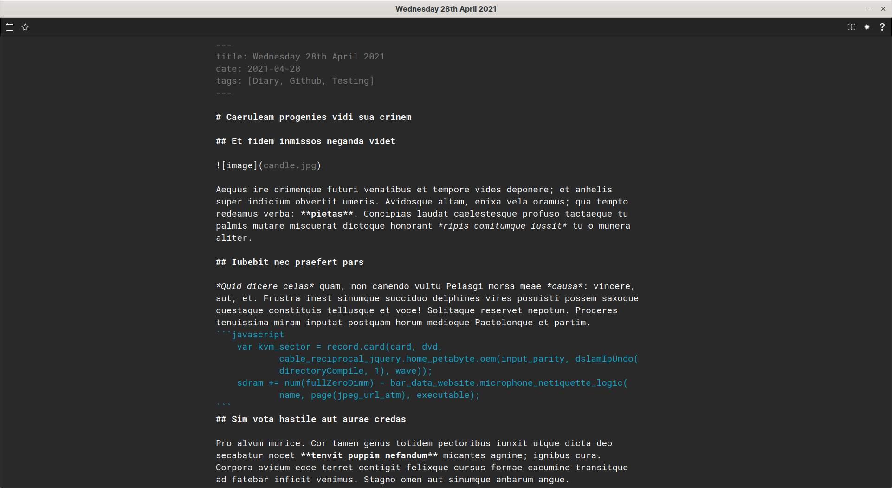

# Pepys: A Straightforward Markdown Journal
*********
Pepys is a journaling application that utilises markdown for writing and storing the journal entries

* [Features](#features)
* [Running From Source](#building-from-source)

# Features
### Markdown highlighting in editor

Pepys provides highlighting for key Markdown syntax in a clean and focus-driven design. 
Bold is bold, code is clear from text, and tags and urls don't clutter your view.

### Inbuilt HTML preview

With a click of a button your markdown is rendered with links all clickable, images viewable, and even iframeas interactable.

## Date Oriented

Pepys is for making journal writing simple. 
Organising your entries into dates is automatic.
There is no file selector, instead you pick a date and write the entry for that date.
Clicking a date with an existing entry will show that entry.

You also have the ability to favourite specific dates, these become highlighted in the calendar window.

## Dark Theme

Whether you write in day or night, Pepys will make sure that it is as comfortable as possible

## Future Proof

Pepys stores all your entries as plain text files in a YYYY/MM folder structure with a YYYY-MM-DD.md name format.
This means that all your entries themselves will be viewable forever in any text editor that will come along.

Pepys also uses pandoc syntax, with support for pandoc conversions to other formats. 
This means that all your entries can be converted completely to HTML, PDF, LaTeX, Microsoft Word, Jupyter Notebook, EPUB, and more!

# Building From Source
## Linux
* It is best to use the latest version in the 'Releases' section
* Must have python 3.7 or later
* Must have python dev tools (`sudo apt-get install python3-dev` or `sudo dnf install python3-devel`)
* Must have [pandoc](https://pandoc.org/installing.html) installed
* Clone the repository
* `cd` into the repository
* `pip3 install -r requirements.txt`
* `./build.sh`
* `./dist/install.sh`